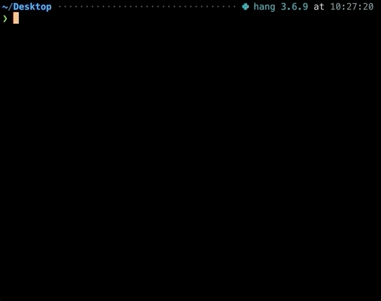

# CLI Hangboard Timer
None of the popular hangboard timers (e.g. [Crimpd](https://my.crimpd.com/workouts) which is awesome!) and random web based HIIT timers I could find have audio integration. I don't have a good way of keeping a device at eye level while on the hangboard and don't want to strain my neck to keep an eye on a device on the ground. Silly problem, yes.

This app pairs with my speaker or bluetooth headphones to lead me through a hangboard sesh (or any type of interval sesh!).

Here is a lil demo. Converting it to gif made it look slo-mo but I promise it actually counts seconds mostly normally. It also plays recordings of my friends telling me to start and stop which is not reflected here :).


### FAQ
* Q: Why is this not a webapp?
* A: idk, will do that eventually

### Requirements
* python3 / pip

This app should work on other systems but this was written and tested on Mac OS Mojave (10.14.6) using Python 3.6.6 and uses some python packages that may be system dependent (e.g. `playsound`).

### Instructions

#### 1. Install:
```bash
$ git clone https://github.com/samryan18/hang-timer.git
$ cd hang-timer
$ pip install .
```

This will create a terminal command, `sesh`.

#### 2. Record some sounds!

Quicktime is an easy option on Mac. Can also crop sounds here.

#### 3. Add your sounds to a directory called `sounds/`

Or ask me for my sounds folder and use my `config.yml` and skip steps 2-4.

#### 4. Create a `config.yml` file. Mine looks something like this:
```yaml
config:
  debug_mode: False
  path: "sounds/"
  sound_paths:
    start: "filename.m4a"
    stop: "filename.m4a"
    done: "filename.m4a"
    encouragement1: "filename.m4a"
    # these keys are hardcoded so use these keys or change the code!
```

#### 5. Check out the CLI Help:
```bash
$ sesh --help
```


#### 6. Run! Here is an example:
```bash
$ sesh --n_sets=18 --time_on=7  --rest_time=3 --delay_before_start=20 
```
You can also just run `$ sesh` to roll with the defaults.

##### Flags:
```bash
--n_sets=N_SETS
    number of total sets
--delay_before_start=DELAY_BEFORE_START
    time delay before start (seconds)
--time_on=TIME_ON
    time for set (seconds)
--rest_time=REST_TIME
    time between sets (seconds)
--encouragement_set=ENCOURAGEMENT_SET
    pick a set to get some extra encouragement!
--config_path=CONFIG_PATH
    path to config
```
